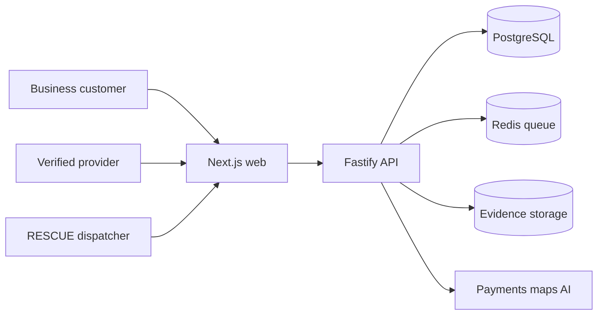
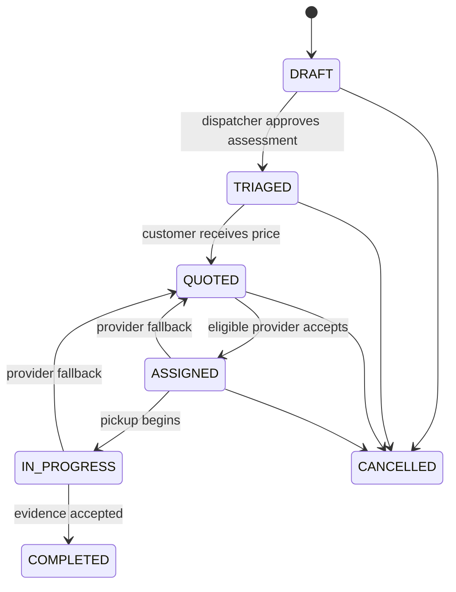

# RESCUE System Architecture

## Goal

RESCUE is a multi-tenant B2B exception-logistics platform. It accepts a failed-delivery, bulky-return or company-surplus problem, structures the operational facts, recommends a recovery plan, dispatches an eligible provider and records evidence.

## Context

## Application layers

1. **Web application** - customer request, provider availability and dispatcher control surfaces.
2. **API boundary** - authentication, authorisation, validation, idempotency and audit logging.
3. **Domain services** - triage, pricing, eligibility, matching, dispatch, fallback and evidence.
4. **Persistence** - PostgreSQL is the source of truth; object storage holds photos and documents.
5. **Async work** - Redis-backed workers send notifications, expire quotes and retry provider offers.
6. **External adapters** - payments, maps, communications and AI are replaceable integrations.

## Core workflow

Fallback returns a job to `QUOTED`, not `TRIAGED`. The customer has already
approved a price; the job needs a different provider, not a new quote. `QUOTED`
is also the only state from which `ASSIGNED` is reachable, which is what
guarantees no job is dispatched without an approved price. This changed during
Phase 2 -- see `docs/adr/0001-fallback-returns-to-quoted.md` for why.

`JOB_TRANSITIONS` in `packages/contracts/src/job.ts` is the authoritative
version of this diagram. The API rejects anything not listed there with
`INVALID_STATE_TRANSITION`.

## Trust boundaries

- Never trust browser-supplied organisation IDs; replace the development placeholder with identity-derived tenancy.
- Provider eligibility must be deterministic: active business, valid insurance, unexpired documents, suitable vehicle and permitted service type.
- AI output is untrusted advisory data. Validate it against Zod schemas and require dispatcher approval.
- Hazardous waste is excluded from the MVP. Unknown material must enter manual review.
- Store only object keys in the database. Use short-lived signed upload/download URLs.
- GPS collection is job-scoped, consent-based and automatically stopped on completion.
- Every status, payout, compliance and manual-override change must create an immutable audit event.

## API conventions

- Versioned path: `/v1`
- Success envelope: `{ "data": ..., "meta"?: ... }`
- Error envelope: `{ "error": { "code": "...", "message": "...", "details"?: ... } }`
- Mutation requests require an idempotency key before payment and dispatch integrations are enabled.
- Monetary amounts are integer euro cents, excluding VAT unless explicitly named.
- Times are UTC ISO 8601; addresses retain the original customer text plus geocoded coordinates.

## Production modules to add

- OIDC authentication and organisation membership
- Prisma-backed job repository
- Provider onboarding and document review
- Quote and pricing service
- Provider eligibility and ranked matching
- Assignment offer queue and fallback state machine
- Payment authorisation, capture, payout and refund ledger
- Evidence uploads with malware scanning and EXIF policy
- Notifications with outbox pattern
- Incident and claims workflow
- GDPR retention, export and deletion processes
- Observability, SLOs and on-call runbooks

## Deployment recommendation

Start with a managed PostgreSQL database, managed Redis, S3-compatible object storage, one API service, one worker service and a separately deployed Next.js web application. Do not introduce Kubernetes or microservices during the Bremen MVP.
